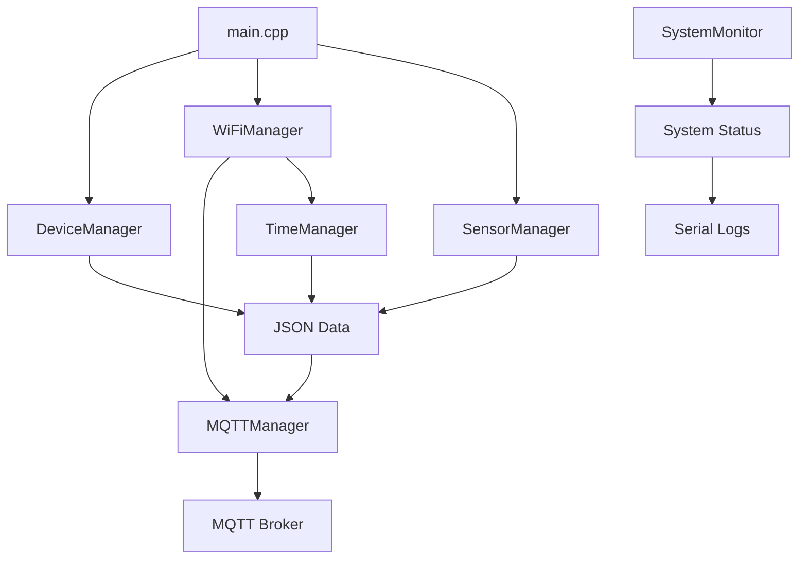

# ESP32 Sensor Firmware - Architecture modulaire

## 📁 Structure du projet

```
esp32-firmware/
├── include/
│   ├── config.h              # Configuration principale (WiFi, MQTT, sites)
│   ├── device_manager.h       # Gestion identification des devices/sites
│   ├── wifi_manager.h         # Gestion connection WiFi et signal
│   ├── mqtt_manager.h         # Gestion connection et communication MQTT
│   ├── time_manager.h         # Synchronisation NTP et timestamps UTC
│   ├── sensor_manager.h       # Lecture capteurs et création JSON
│   └── system_monitor.h       # Monitoring système et alertes
├── src/
│   ├── main.cpp              # Point d'entrée principal (simplifié)
│   ├── device_manager.cpp     # Implémentation device/site management
│   ├── wifi_manager.cpp       # Implémentation WiFi
│   ├── mqtt_manager.cpp       # Implémentation MQTT
│   ├── time_manager.cpp       # Implémentation NTP/Time
│   ├── sensor_manager.cpp     # Implémentation capteurs
│   └── system_monitor.cpp     # Implémentation monitoring
└── README_ARCHITECTURE.md     # Cette documentation
```

## 🏗️ Architecture modulaire

### 📱 **DeviceManager**
- **Responsabilité** : Identification du device et mapping avec les sites
- **Fonctions** : MAC address → Site ID/Name
- **Usage** : `deviceManager.identifySite()`, `deviceManager.getDeviceId()`

### 📶 **WiFiManager** 
- **Responsabilité** : Connexion WiFi, monitoring signal, stabilité
- **Fonctions** : Connexion, reconnexion, évaluation qualité signal
- **Usage** : `wifiManager.connect()`, `wifiManager.isSignalStable()`

### 📡 **MQTTManager**
- **Responsabilité** : Connexion MQTT, publication, gestion erreurs
- **Fonctions** : Connexion sécurisée, retry logic, Last Will Testament
- **Usage** : `mqttManager.connect()`, `mqttManager.publish()`

### ⏰ **TimeManager**
- **Responsabilité** : Synchronisation NTP, timestamps UTC RFC3339
- **Fonctions** : Sync périodique, fallback système, monitoring sync
- **Usage** : `timeManager.maintainSync()`, `timeManager.getFormattedDateTime()`

### 🌡️ **SensorManager**
- **Responsabilité** : Lecture capteurs DHT, création JSON, scheduling
- **Fonctions** : Lecture données, validation, sérialisation JSON
- **Usage** : `sensorManager.readSensor()`, `sensorManager.createDataJson()`

### 🔍 **SystemMonitor**
- **Responsabilité** : Monitoring heap, alertes, rapports système
- **Fonctions** : Tracking mémoire, alertes automatiques, status complet
- **Usage** : `systemMonitor.checkSystem()`, `systemMonitor.printSystemStatus()`

## 🔄 Flux de données



## ⚡ Avantages de cette architecture

### ✅ **Maintenabilité**
- Code organisé par responsabilité
- Modules indépendants et testables
- Interface claire entre modules

### ✅ **Réutilisabilité**
- Managers réutilisables dans d'autres projets
- Configuration centralisée
- API cohérente

### ✅ **Debugging facilité**
- Logs spécifiques par module
- Isolation des problèmes
- Status détaillé par composant

### ✅ **Évolutivité**
- Ajout facile de nouveaux capteurs
- Extension des protocoles de communication
- Modification indépendante des modules

## 🎯 Points d'entrée principaux

### **setup()** - `main.cpp:9`
1. Initialisation des modules
2. Connexion WiFi
3. Configuration MQTT/NTP
4. Rapport initial système

### **loop()** - `main.cpp:32`
1. Maintenance des connexions
2. Monitoring système
3. Lecture/envoi données capteurs
4. Gestion des erreurs

## 📊 Données envoyées

### **Topic** : `datayoti/sensor/{device_id}/data`
```json
{
  "device_id": "1C:69:20:E9:18:24",
  "timestamp": "2025-10-04T14:30:25.000Z",
  "temperature": 22.5,
  "humidity": 65.0
}
```

### **Topic** : `datayoti/sensor/{device_id}/heartbeat`
```json
{
  "device_id": "1C:69:20:E9:18:24",
  "site_id": "SITE_001", 
  "timestamp": "2025-10-04T14:30:25.000Z",
  "rssi": -45,
  "free_heap": 123456,
  "uptime": 3600,
  "min_heap": 120000,
  "ntp_sync": true
}
```

## 🔧 Configuration

Toute la configuration se trouve dans `include/config.h` :
- Paramètres WiFi
- Configuration MQTT
- Mapping MAC → Sites
- Intervalles de mesure
- Paramètres NTP

## 🚀 Compilation

Utiliser PlatformIO avec les dépendances suivantes :
- ESP32 Core
- ArduinoJson
- PubSubClient
- DHT sensor library
- NTPClient

Le projet est maintenant **modulaire**, **maintenable** et **évolutif** ! 🎉